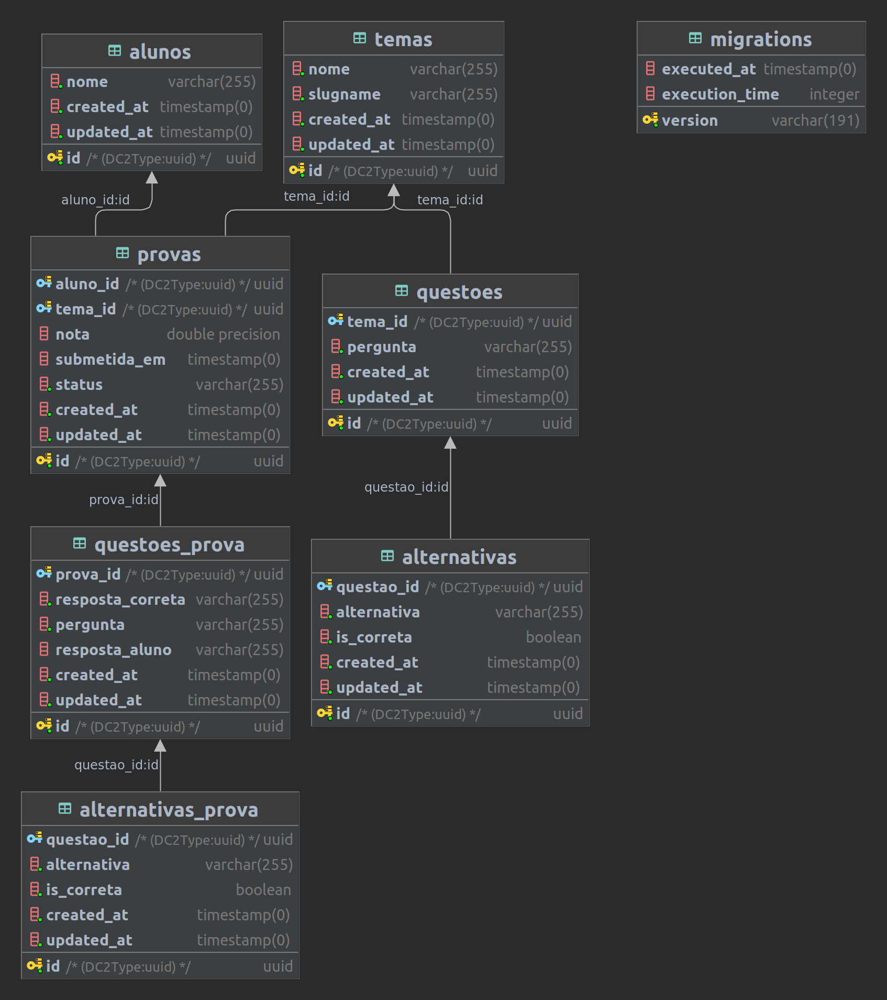

# Projeto PDI - Sistema de provas (Quiz)

## 📋 Pré-requisitos
* docker
* docker-compose

## 🔧 Instalação
Clone o projeto e entre em seu diretório

### Iniciando o container pela primeira vez
```sh
make build-and-serve
```

### Após levantar o container rode para criar as tabelas e a seed
```sh
make db_update
```

### Nas próximas vezes só levante o container
```sh
make serve
```

## 🚀 Implantação

### Gere a chave da aplicação
```sh
make key-generate 
```
## ⚙️ Executando os testes
```sh
make all-tests
```

## 🛠️ Construído com
Esse repo foi construído com as seguintes ferramentas:

* [AmazonLinux](https://hub.docker.com/_/amazonlinux/)
* [Laravel](https://laravel.com/)
* [PHP 8.0.20](https://hub.docker.com/_/php?tab=tags)

## Migration do banco
[Migração do banco de dados](database/migrations/Version20221004211601.php)

## Diagrama banco de dados



## ✒️ Autor

* **Marx Neves** - *Trabalho ~~Inicial~~ Único*
